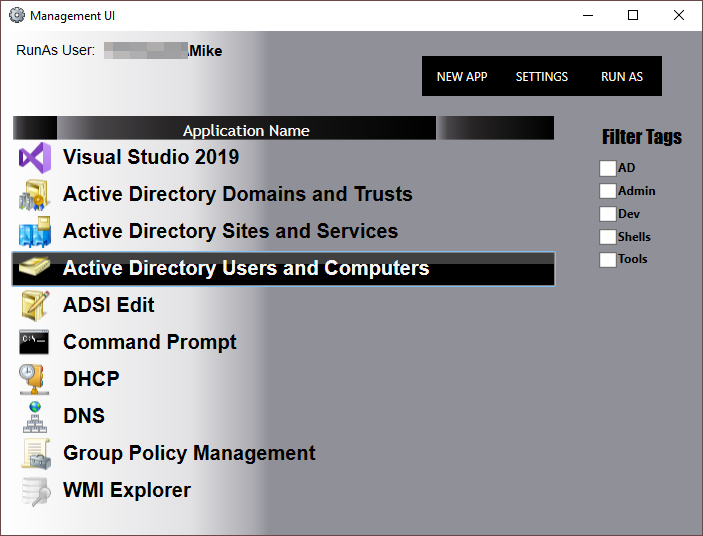
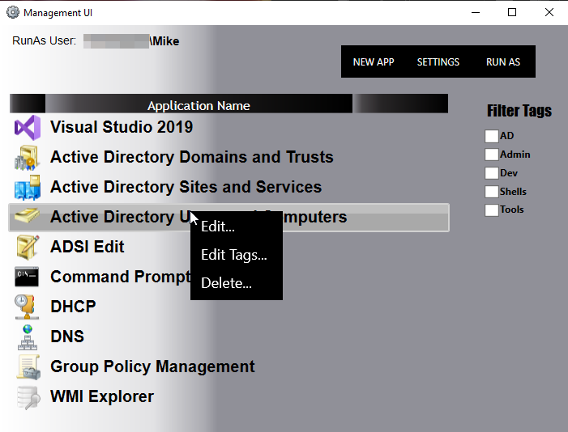
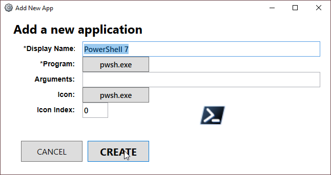

#  Management UI

A simple WPF XAML-based application that can store executable/command line (and arguments) applications that can be launch by double-clicking.

Additionally, another set of credentials can be stored to be used as the "RunAs" account for the list of applications.

The list of applications and settings are stored as JSON files in:

_%LOCALAPPDATA%\Mike Garvey\ManagementUI_

## __* NOTICE *__

__This app NEVER stores credentials physically, 'anywhere'.  Credentials used for the RunAs account are held in memory (with the passwords as [SecureStrings](https://docs.microsoft.com/en-us/dotnet/api/system.security.securestring?view=netframework-4.8)) until the application stops.__  

They must be manually entered every time Management UI launches.

---

## Basic Usage

Apps can be added, edited, and removed from the UI
* __Add__ - Clicking the "New App" button.
* __Edit, Remove__ - Right-clicking the app in the list.

Tags used for filtering can be added to an applications.  Right-click the app and select "Edit Tags...".

### Keyboard Shortcuts

* __E__ - Opens the "Edit Tags" window if pressed while an application is selected from the list.

* __DEL__ - Shortcut for deleting an application from the list.

* __CTRL+A__ - Opens the text file (in JSON) that contains the application definitions. *Any changes made require a restart of the app to be reflected*

* __CTRL+O__ - Opens the Settings json text file (same as clicking the 'Settings' button).

## Example Screenshots

